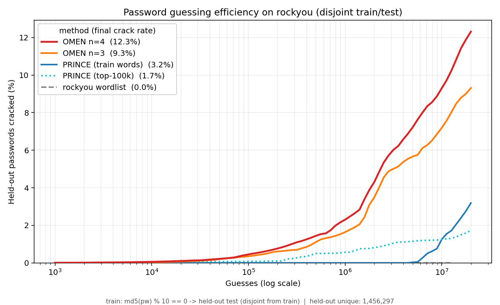

# OMEN-reborn

A clean-room **Ordered Markov ENumerator** for probability-ranked password
candidate generation, written in modern, dependency-free Python.

OMEN builds an order-`n` Markov model from a corpus of (cracked) passwords and
streams candidate guesses in (approximately) descending probability order. That
ordering is the whole point: a back-end like hashcat tries the most likely
passwords first, so it cracks more for the same number of guesses.

This is an **independent implementation written from the published algorithm**
(Dürmuth et al., *OMEN: Faster Password Guessing Using an Ordered Markov
Enumerator*, ESSoS 2015). No code from the original RUB-SysSec OMEN is used.

## Benchmark: OMEN vs. PRINCE

Trained on 90% of `rockyou` and evaluated on the **disjoint** held-out 10%
(split by `md5(password) % 10`, so no password is in both sets). The chart shows
the cumulative share of the 1,456,297 held-out passwords cracked as a function
of the number of guesses.



| Method | Crack rate @ 20M guesses |
|--------|-------------------------:|
| **OMEN n=4** | **12.3%** |
| OMEN n=3 | 9.3% |
| PRINCE (train words) | 3.2% |
| PRINCE (top-100k) | 1.7% |
| rockyou wordlist (replay) | 0.0% |

OMEN cracks **~4× more** than the best PRINCE configuration at the same guess
budget, because it generates novel character sequences from a Markov model
rather than recombining existing words. The wordlist baseline sits at exactly
**0.0%** — replaying training words cracks nothing on a disjoint test set, which
confirms there is no train/test leakage and that every OMEN crack is genuine
generalisation. (PRINCE's real strengths — no training, direct hashcat
pipelining, no alphabet/length limits — are operational, not ordering quality.)

Full methodology and a one-command reproduction are in
[`benchmarks/`](benchmarks/README.md).

## Why a rewrite

The original C implementation is unmaintained and crashes on modern glibc, the
old `py-omen` requires Python 3.6, and the algorithm's reference behaviour is
hard to reproduce. Rather than patch dead C, this project re-derives the
algorithm cleanly with:

- a single, well-defined level model shared across all tables,
- length modelled as a first-class term in the ordering (common lengths rank
  earlier — not just within a fixed length),
- untrusted-input hardening on every model load, and
- full type hints, `mypy --strict`, `ruff`, and a pytest suite.

## Install

Runtime is **stdlib-only**. For development:

```bash
python -m venv .venv && . .venv/bin/activate
pip install -e ".[dev]"
```

Without installing, run as a module from the repo root: `python -m omen ...`.

## Usage

```bash
# 1. Train a model from a password list
omen train -i cracked.txt -m model/ --ngram 3 --levels 11 --max-length 20

# 1b. Sparse org corpus? Supplement it with the first 500K rockyou passwords
#     so the n-gram model isn't starved on a handful of cracks (0 = whole file)
omen train -i cracked.txt -m model/ --supplement rockyou.txt --supplement-lines 500000

# 2. Stream ranked candidates (this is what you pipe into a cracker)
omen generate -m model/ --max-guesses 5000000 | hashcat -a 0 -m 1000 hashes.txt

# 3. Score individual passwords (clean replacement for evalPW)
omen eval -m model/ Password1 hunter2 --rank

# 4. Inspect a trained model
omen inspect -m model/

# 5. Choose / preview an alphabet from a corpus
omen alphabet -i cracked.txt --size 72
```

### Commands

| Command    | Purpose                                                        |
|------------|---------------------------------------------------------------|
| `train`    | Corpus → model directory.                                     |
| `generate` | Stream ranked candidates to **stdout** (SIGPIPE-clean).       |
| `eval`     | Per-password total level, component breakdown, optional rank. |
| `alphabet` | Select the most frequent characters and report coverage.      |
| `inspect`  | Model metadata, table sizes, per-table level histograms.      |
| `spool`    | Chunk a producer's output into tmpfs files; attack each with hashcat. |

## How it works

Each conditional probability is discretised into an integer **level**
(0 = most probable, `NL-1` = least), via `level(p) = round(-ln p / lam)`. A
candidate's **total level** is the sum of its components:

```
total = IP(initial n-1 gram) + Σ CP(transition) + EP(ending) + LN(length)
```

The enumerator walks `total = 0, 1, 2, …` and emits *every* candidate at the
current total before advancing, so the output stream is globally non-decreasing
in level. A single `LevelScale` is shared by all tables so the components are
additive and comparable. `omen eval` recomputes this exact value, so a
password's score always equals the level the generator would emit it at.

## Model format

A model is a directory:

- `config.json` — version, `ngram`, `levels`, `lam`, smoothing, alphabet, length
  levels, coverage. **Fully validated before any table is allocated.**
- `ip.dat`, `cp.dat`, `ep.dat` — flat one-byte-per-entry level tables, indexed
  by packed alphabet codes (the native enumerator `mmap`s them directly).
- `manifest.bin` — fixed-layout little-endian header (ngram, levels, `lam`,
  alphabet, length levels) for the C enumerator, so it never parses JSON.

Dense tables are `A^n` entries (`A` = alphabet size). Memory grows fast with
`n`: at `A≈72`, `n=3` is ~370 KB and `n=4` is ~27 MB; `n=5` is rejected. Keep
the alphabet reduced (the default auto-selects the 72 most frequent characters)
and prefer `n=3` or `n=4`.

## Architecture

| Module          | Responsibility                                               |
|-----------------|--------------------------------------------------------------|
| `alphabet.py`   | `Alphabet` value object + frequency-based `select_alphabet`. |
| `levels.py`     | `LevelScale` — probability ↔ level mapping.                  |
| `model.py`      | `NgramModel` — tables, queries, validated save/load.         |
| `train.py`      | `ModelTrainer` — corpus → counts → smoothing → tables.       |
| `enumerate.py`  | `Enumerator` Protocol + `PyEnumerator` (ordered stream).     |
| `score.py`      | `PasswordScorer` — level + rank estimation.                  |
| `inspect.py`    | `ModelInspector` — human-readable report.                    |
| `io_utils.py`   | Buffered `ByteSink`, `LineSink` protocol, corpus reader.     |
| `cli.py`        | Thin argparse dispatch over the objects above.               |

## Performance: native enumerator + chunked feeding

The pure-Python `PyEnumerator` emits ~10⁵ candidates/s — fine for analysis, too
slow to feed a fast GPU back-end. Two pieces close the gap:

### Native C enumerator (`native/omen-enum`)

A standalone C program that reads the same model directory (`mmap`s the level
tables, reads `manifest.bin`) and streams candidates **byte-for-byte identical**
to `PyEnumerator`, **~50–100× faster** (≈5–10M candidates/s, host-dependent;
parity verified by `tests/test_native_parity.py`). Build and use it as a drop-in
producer:

```bash
make -C native                      # produces native/omen-enum
native/omen-enum model/ --max-guesses 50000000 | hashcat -a 0 -m 1000 hashes.txt
```

It mirrors the Python flags (`--max-guesses/--max-level/--min-length/--max-length`).

**Portability.** `omen-enum` is **POSIX-only** (it uses `mmap`/`unistd`) and builds
on Linux and macOS. On Windows — or any host without a C compiler — use the
pure-Python enumerator instead, invoked as `python -m omen generate …` (a bare
`omen` shebang script is not directly executable on Windows; the `omen` console
script exists only after `pip install`). Both enumerators emit byte-identical
ordering, so a model trained once works with either.

### Chunked spool-and-attack (`omen spool`)

Piping into hashcat over stdin caps throughput — hashcat can't `mmap` a pipe,
loses its wordlist amplifier, and stalls on backpressure (the "fast burst, then
~300 MH/s" effect). A FIFO doesn't help either: hashcat `mmap`s its wordlist, and
a FIFO isn't seekable. The fix is a **RAM-backed file hashcat *can* `mmap`**:
spool the producer into bounded tmpfs (`/dev/shm`) chunk files and attack each,
**double-buffered** (fill chunk N+1 while attacking chunk N):

```bash
omen spool --hashcat "hashcat -a 0 -m 1000 {chunk} hashes.txt" --chunk-mb 512 \
           -- native/omen-enum model/
```

**Sizing `--chunk-mb`.** Each chunk is a *fresh* hashcat process — device init and
kernel-cache build cost a few seconds per launch. On a fast GPU a small chunk drains
in ~1–2 s and that per-chunk startup dominates, so **prefer large chunks** (GB-range
`--chunk-mb`) to amortize it. The bound is RAM: the double-buffer keeps ~2 chunks
resident, so budget ~2× the chunk size. Rule of thumb — size a chunk to give each
hashcat invocation tens of seconds to a few minutes of work.

**Throughput reality check.** A *raw, ruleless* feed against a fast hash (NTLM)
is bound by the candidate rate — each candidate is one hash — so the C enumerator
is the lever there. The chunked-file win is largest for **amplified** attacks
(base list × `-r` rules on the GPU) and **slow hashes**, where mmap feeding keeps
the GPU saturated instead of starving it on stdin.

## Development

```bash
ruff check . && ruff format --check . && mypy && pytest -q
```

## License

MIT — see [LICENSE](LICENSE).
